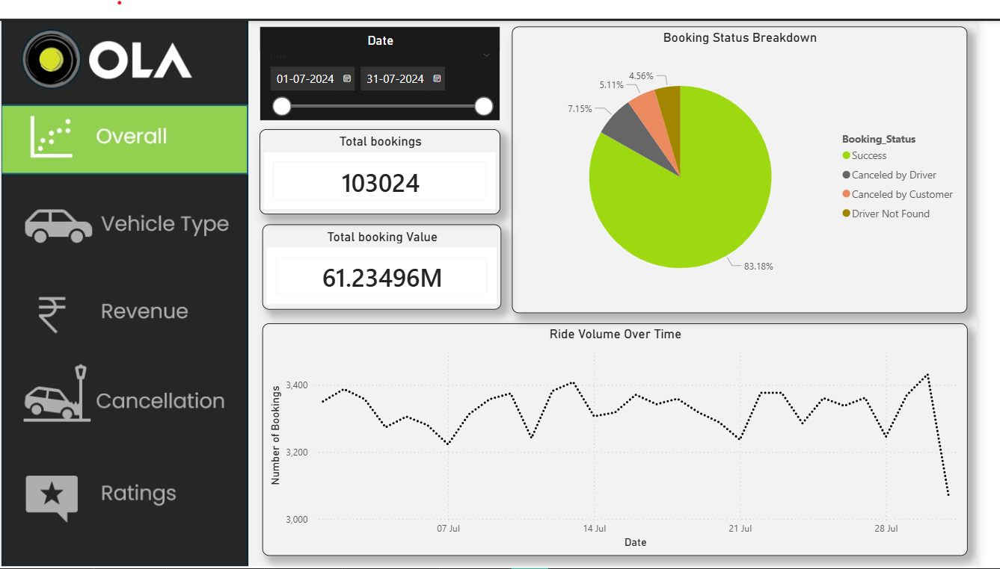

# 📊 OLA Ride Booking Data Analysis

## 📊 Dashboard Preview

The project follows a structured data analytics workflow from data preparation to insight generation.

## 📌 Problem Statement

This project analyzes ride booking data to identify demand patterns, cancellation drivers, customer behavior, and revenue opportunities to improve operational efficiency.

---

## 🎯 Business Objectives

- Analyze ride booking trends over time
- Identify key drivers of ride cancellations
- Understand customer and driver behavior
- Evaluate revenue distribution across segments
- Improve booking success rate

---

## ❓ Business Problems Solved

### 🔹 SQL-Based Analysis

1. Retrieve all successful bookings
2. Find the average ride distance for each vehicle type
3. Calculate total number of rides cancelled by customers
4. Identify top 5 customers with highest ride bookings
5. Analyze driver cancellations due to personal/car-related issues
6. Determine maximum and minimum driver ratings for Prime Sedan
7. Extract rides paid using UPI
8. Calculate average customer rating per vehicle type
9. Compute total booking value of successful rides
10. Identify incomplete rides along with reasons

---

### 🔹 Power BI Analysis

1. 📈 Ride Volume Over Time (trend analysis)
2. 📊 Booking Status Breakdown (success vs cancellations)
3. 🚗 Top Vehicle Types by Ride Distance
4. ⭐ Average Customer Ratings by Vehicle Type
5. ❌ Cancellation Reasons (Customer vs Driver)
6. 💰 Revenue by Payment Method
7. 🧑‍💼 Top 5 Customers by Booking Value
8. 📏 Ride Distance Distribution
9. 👨‍✈️ Driver Ratings Distribution
10. 🔄 Customer vs Driver Ratings Comparison

---

## 🛠 Tools & Technologies

- SQL (Data querying & analysis)
- Power BI (Dashboard & visualization)
- Python (Data generation & variation)

---

## 📂 Dataset

- 100,000+ ride booking records
- Includes:
  - Booking Status
  - Vehicle Type
  - Ride Distance
  - Booking Value
  - Payment Method
  - Customer & Driver Ratings

---

## 📊 Key KPIs

- Total Bookings
- Success Rate (%)
- Cancellation Rate (%)
- Revenue by Vehicle Type
- Average Booking Value
- Average Ride Distance

---

## 📈 Key Findings Summary

- 📈 Ride demand shows clear variation across time, indicating peak usage periods and potential supply-demand imbalance

## 🔍 Key Insights

- 🚨 High cancellation rate (~38%) driven mainly by driver-related issues
- 💰 Premium vehicles (Prime SUV, Prime Sedan) generate higher revenue
- 🚗 Auto rides dominate short-distance travel but contribute less revenue
- 📈 Demand varies across time, indicating peak usage periods
- 💳 Cash and UPI dominate payment preferences

---

## 💡 Business Recommendations

- Improve driver reliability through incentives
- Optimize supply during peak demand periods
- Focus on premium vehicle segments for higher profitability
- Encourage digital payments for smoother transactions

---

## ⚠️ Data Validation & Debugging

- Identified and fixed vehicle mapping inconsistency (Bike vs E-Bike)
- Ensured logical correctness (Success Booking Value ≤ Total Booking Value)
- Avoided misuse of visual filters by applying correct aggregation logic

---

## 🧠 Challenges Faced

- Handling inconsistent dataset mappings
- Creating realistic data variation
- Ensuring correct aggregation in Power BI

---

## 🎥 Interactive Dashboard Demo
[Watch the Demo Video](https://drive.google.com/file/d/1szjri-fZ6qGKTXZJQjFMIht-zJwcMy7B/view?usp=sharing)

---

## 📁 Project Structure

- **data/**
  - Contains the final dataset with realistic variations (weekend demand, cancellations, pricing)

- **sql/**
  - SQL queries and views used to solve business problems and extract insights

- **dashboard/**
  - Power BI dashboard file with interactive visualizations and KPIs

- **images/**
  - Dashboard screenshots used for preview and documentation

- **README.md**
  - Project documentation including business problems, insights, and recommendations

