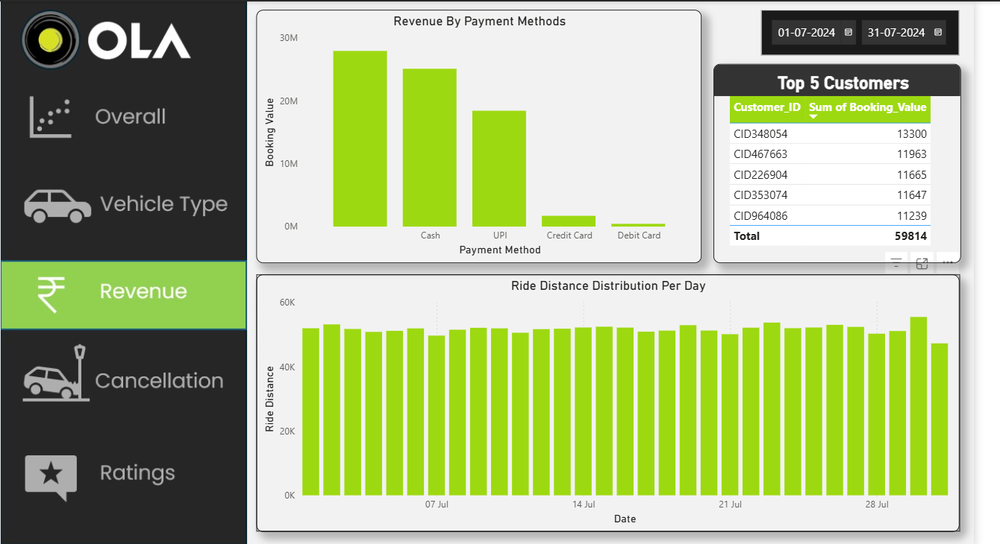
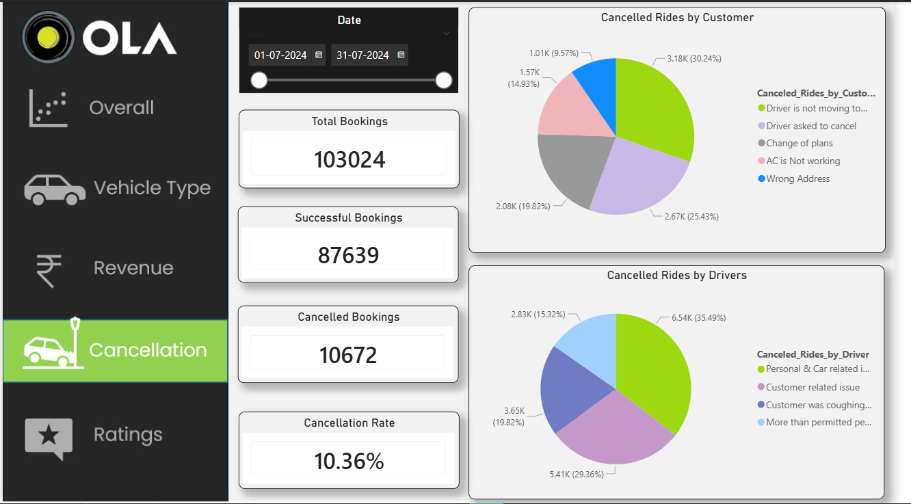
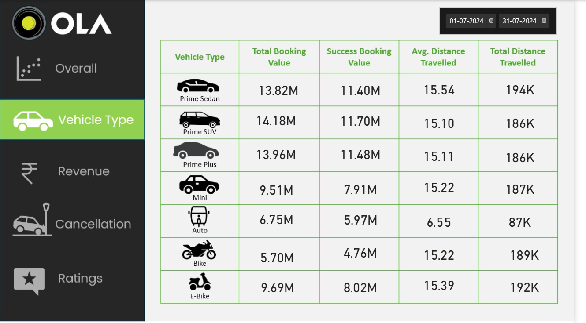

# 📊 OLA Ride Booking Data Analysis

## 📌 Problem Statement
Analyze ride booking data to identify demand patterns, cancellation drivers, and revenue opportunities to improve operational efficiency and customer experience.

---

## 🎯 Business Objectives
- Reduce cancellation rate
- Identify high-revenue vehicle segments
- Understand customer behavior patterns
- Improve booking success rate

---

## 🛠 Tools & Technologies
- SQL (Data analysis & querying)
- Power BI (Dashboard & visualization)
- Python (Data generation & variation)

---

## 📂 Dataset
- 100,000+ ride booking records
- Features include:
  - Booking Status
  - Vehicle Type
  - Ride Distance
  - Booking Value
  - Payment Method
  - Customer & Driver Ratings

---

## 📊 Key KPIs
- Total Bookings
- Success Rate (%)
- Cancellation Rate (%)
- Revenue by Vehicle Type
- Average Ride Distance

---

## 📊 Dashboard Features
- Ride volume trends over time
- Revenue distribution by vehicle type
- Cancellation analysis (Customer vs Driver)
- Payment method breakdown
- Top customers analysis

---

## 🔍 Key Insights

- 🚨 High cancellation rate (~38%) driven primarily by driver-related issues  
- 💰 Premium vehicles (Prime SUV, Prime Sedan) generate significantly higher revenue  
- 🚗 Auto rides dominate short-distance trips but contribute less revenue  
- 📈 Demand shows variation across time, indicating peak usage periods  
- 💳 Cash and UPI are the most preferred payment methods  

---

## 💡 Business Recommendations

- Improve driver reliability through incentive mechanisms  
- Focus on premium vehicle categories to maximize revenue  
- Optimize driver allocation during peak demand periods  
- Encourage digital payments for smoother transactions  

---

## ⚠️ Data Validation & Debugging

- Identified and corrected vehicle mapping inconsistency (Bike vs E-Bike)  
- Ensured logical consistency (e.g., Success Booking Value ≤ Total Booking Value)  
- Avoided misuse of visual filters by applying correct aggregation logic  

---

## 🧠 Challenges Faced

- Handling inconsistent dataset mappings  
- Ensuring correct aggregation logic in Power BI  
- Creating realistic data variation for meaningful insights  

---
### 📊 Dashboard Preview

---

## 🎥 Demo

[Watch Dashboard Demo](https://drive.google.com/file/d/1szjri-fZ6qGKTXZJQjFMIht-zJwcMy7B/view?usp=sharing)

---

## 📁 Project Structure
